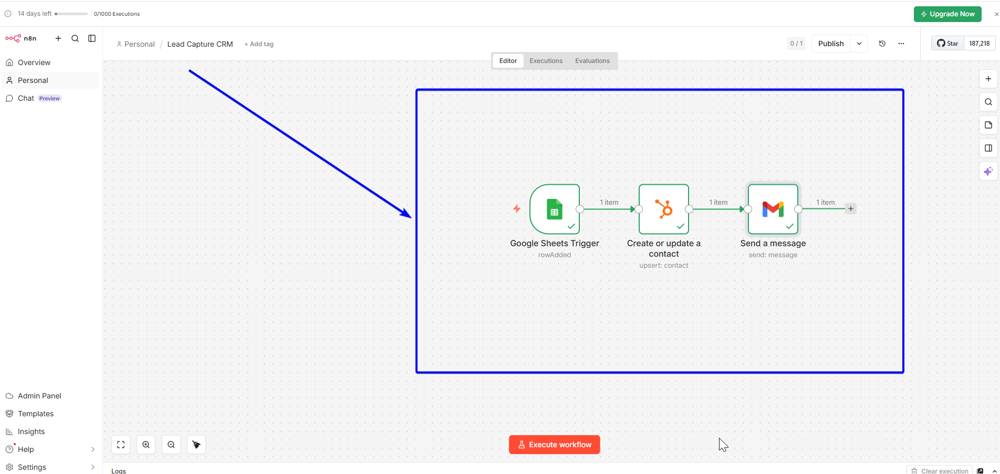

# n8n-lead-capture-crm-automation

# 📋 Lead Capture to CRM Automation — n8n

An end-to-end lead capture automation that transforms Google Form submissions into HubSpot CRM contacts and instantly sends a personalized welcome email — all without any manual input.

---

## 🔍 Problem It Solves

Businesses lose leads when form submissions aren't followed up quickly. Manual data entry into a CRM is slow, error-prone, and often delayed. This workflow ensures that every new lead is:

- Instantly captured and stored in HubSpot CRM
- Automatically sent a professional welcome email within seconds
- Never lost, forgotten, or manually entered

---

## ⚙️ How It Works

```
Google Forms → Google Sheets Trigger → HubSpot (create contact) → Gmail (send welcome email)
```

1. **Google Forms** — visitor submits a contact form with Name, Email, Phone, Address, and Message
2. **Google Sheets Trigger** — n8n detects the new row added to the linked spreadsheet
3. **HubSpot Node** — automatically creates or updates a contact in HubSpot CRM with all form data
4. **Gmail Node** — instantly sends a personalized welcome email to the new lead

---

## 🛠️ Tools & Integrations

| Tool | Purpose |
|------|---------|
| n8n | Workflow automation engine |
| Google Forms | Lead capture form |
| Google Sheets | Form response storage and trigger |
| HubSpot CRM | Contact management and storage |
| Gmail API | Automated welcome email delivery |

---

## 📸 Workflow Preview



---

## 🎥 Demo

[▶ Click to watch the demo video](https://youtube.com/your-link-here)

---

## 🚀 How to Use This Workflow

### Prerequisites

- n8n account (free at [n8n.io](https://n8n.io))
- Google account (Gmail + Google Forms + Google Sheets)
- HubSpot free account ([hubspot.com](https://hubspot.com))

### Setup Steps

**1. Create your Google Form**
- Go to [forms.google.com](https://forms.google.com)
- Create a form with fields: Name, Email, Phone number, Address, Comments
- Link it to a Google Sheet via Responses tab → Sheets icon

**2. Import the workflow**
- Download `workflow.json` from this repo
- In n8n, go to **Workflows** → **Import from file**
- Select `workflow.json`

**3. Connect your credentials**
- **Google Sheets node** → add Google OAuth2 credential
- **HubSpot node** → connect via OAuth2 (sign in with HubSpot)
- **Gmail node** → add Google OAuth2 credential

**4. Configure the workflow**
- In the Google Sheets trigger: select your `Form Responses` spreadsheet
- In the HubSpot node: verify field mappings match your form column names
- In the Gmail node: customize the welcome email subject and body

**5. Field Mapping Reference**

| HubSpot Field | Google Sheets Expression |
|---|---|
| Email | `{{ $json['Email'] }}` |
| First Name | `{{ $json['Name'] }}` |
| Phone | `{{ $json['Phone number'] }}` |

**6. Activate**
- Toggle the workflow **ON**
- Submit a test form entry
- Check HubSpot Contacts — new contact should appear
- Check your email — welcome message should arrive instantly ✅

---

## 📁 Files

```
├── workflow.json          # n8n workflow export (import directly into n8n)
├── workflow-preview.png   # Screenshot of the n8n canvas
└── README.md              # This file
```

---

## 💡 Possible Extensions

- Add a Slack/Teams notification when a new lead comes in
- Score leads based on their message content using AI
- Send a follow-up email after 24 hours if no reply
- Add the lead to a specific HubSpot pipeline/deal stage
- Send internal email alert to sales team with lead details
- Connect to Calendly for automatic meeting booking

---

## 👤 Author

**Kodjo Hugues Ballo**
IT Support & Automation Specialist | Python | Active Directory | n8n

- 🔗 [Upwork Profile](https://www.upwork.com/freelancers/~014627f395c6a1484e)
- 💼 [LinkedIn](https://www.linkedin.com/in/kodjo-hugues-ballo-141327158/)
- 🐙 [GitHub](https://github.com/kodjoballo)

---

## 📄 License

MIT — free to use and adapt.
